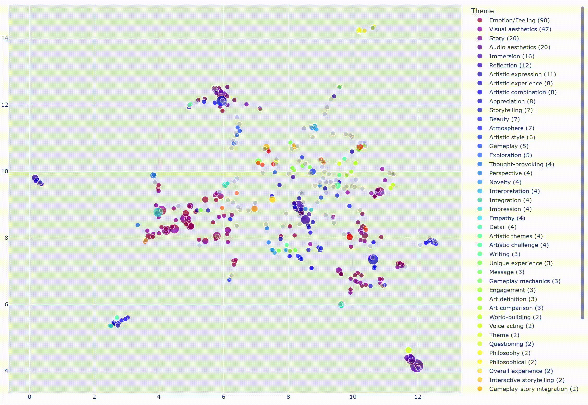

This repository contains the **LLMCode** Python toolkit for **AI-assisted qualitative data analysis and visualization** using Large Language Models (LLMs). This is a further development of the initial version used for the CHI 2023 paper [Evaluating Large Language Models in Generating Synthetic HCI Research Data: a Case Study.](https://dl.acm.org/doi/abs/10.1145/3544548.3580688)

Here's an example of the codes and themes created by LLMCode for text data about experiencing video games as art:


Currently, we support OpenAI models via both OpenAI API and Aalto University's Azure OpenAI API. The latter provides better data privacy and is GDPR-safe.


### Executive Summary
Traditional qualitative content analysis and thematic analysis can very labor-intensive, and our goal is to enable extending such analyses to **large-scale data** such as online discussions. At the same time, we believe that **AI should clean and do the dishes while humans do creative work and research**, not the other way around. Thus, we prioritize **researcher agency and control** by allowing researchers to define and guide the analysis style through manually annotated data such as [this word document](https://raw.githubusercontent.com/PerttuHamalainen/LLMCode/master/test_data/bopp_test_augmented_feelings2.docx) that contains descriptions of artistic video game experiences coded for feelings and emotions they elicit. The more data you annotate manually, the more accurately LLMCode can mimic your annotations and the more reliably you can analyze and quantify LLMCode's output reliability and quality.

Preferences about AI use vary&mdash;LLMCode supports multiple workflows with varying degrees of automation:

- Prefer to do manual analysis? Our data visualization tools might still be useful in immersing oneself in one's data. LLMCode can also be used to check for the consistency of your manual data coding.
- Prefer to do manual analysis but have too much data? Try using LLMCode to highlight or extract relevant text passages to speed up the analysis.
- Like to do manual analysis, but have limited time or your brain gets fried after enough hours? Code as much data as you can and let LLMCode handle the rest.
- Are you an industry user researcher looking for quick results? LLMCode can also run automatically based on a few coding examples and produce a report of the key themes, although we do not recommend this for academic research where reliability is paramount.


### How to use

#### Step 1: Setup an OpenAI account if you don't have an Aalto Azure OpenAI API key
1. Create an OpenAI account at [https://platform.openai.com](https://platform.openai.com).
2. Go to the account management page
3. Choose "Billing" and buy a fixed amount of usage (at least 1€) or setup continuous billing (with a monthly quota for safety reasons)
4. Choose "API keys" and create an API key. The system gives you a private key that you should store in a safe place, e.g., a password manager. See Step 4 below for how to use the stored key.

*Important info regarding API costs:*
* LLM API calls cost money. YOU USE LLMCODE AT YOUR OWN RISK.
* To minimize costs, it's good to first test with smaller datasets of up to few hundred paragraphs. Analyzing such data typically costs less than 1€
* It is also recommended to use the OpenAI management interface to limit API spend, either by purchasing fixed amounts of credits or defining a monthly quota
* LLMCode minimizes the costs by caching the LLM API query results. This means that if you code the exact same data again with the same model, instructions, and examples, the results will be returned from the cache. If you need to delete the cache, e.g., to save disk space, you can navigate to where you installed the LLMCode (see below), navigate to the ```_LLM_cache``` folder and delete the subfolders.  


#### Step 2: Try the notebook interface on Google Colab.
Note: Colab needs a Google account. If you are an Aalto University student or researcher, you can either use a personal account or your Aalto Google account by signing in to Google with your Aalto email.

The notebooks are designed as a series of tutorials with default test data, but you can also swap in and process your own data.

Notebook 1: [Data visualization and exploration](https://colab.research.google.com/github/PerttuHamalainen/LLMCode/blob/master/data_exploration_and_visualization.ipynb).

Notebook 2: [Relevant text extraction or highlighting](https://colab.research.google.com/github/PerttuHamalainen/LLMCode/blob/master/relevant_data_highlighting.ipynb).

Tutorial 3: [Inductive and deductive coding](https://colab.research.google.com/github/PerttuHamalainen/LLMCode/blob/master/inductive_and_deductive_coding.ipynb).

Tutorial 4: [From codes to themes](https://colab.research.google.com/github/PerttuHamalainen/LLMCode/blob/master/themes.ipynb).

#### Step 3: Install and run the notebooks locally
Google Colab is the fastest way to try LLMCode, but if you want to avoid your data being processed by Google, you should install and run LLMCode locally.

Download and install [Anaconda](https://www.anaconda.com/) and [git](https://git-scm.com), if you don't already have them.

Open the Anaconda command prompt and run the following commands:

    conda create --name llmcode python=3.8
    activate llmcode
    git clone https://github.com/PerttuHamalainen/LLMCode
    cd LLMCode
    pip install -r requirements.txt
    jupyter notebook

The last line should launch the Jupyter notebook interface in your browser. Note that this interface doesn't have Colab's UI functionality and instead of using the sliders and other UI elements, you have to edit the values directly in the code.


### Why not just use ChatGPT/GPT-4?
The most recent LLMs like ChatGPT can conduct a form of qualitative analysis out of the box: Just paste your data to the chat, and ask ChatGPT to identify themes. However, this has two major problems:

* All data must fit the maximum context size.
* Evaluating the quality and correctness of the results is hard. Often, ChatGPT may simply neglect large parts of your data.

LLMCode addresses the problems above:
* LLMCode only requires that a single coded text and the coding examples fit the context.
* LLMCode allows comparing the results to human-annotated data both quantitatively and qualitatively, which helps in both evaluating the severity of the LLM errors. Furthermore, the error analysis often reveals inconsistencies and mistakes in the human-annotations.


### Todo

* Colab notebook to allow usage without installing anything
* Interactive visualization and visual editing of the examples, codes, and themes
* Support for other language models such as Llama 2 — using a local model would mitigate the data protection issues one may have with OpenAI’s models.
* More thorough validation, once we have enough ground truth codes from multiple human coders
* Export to Atlas.ti and other qualitative analysis software, to allow more flexible manual refinement
* Automatic extraction of coded snippets from longer texts.


### Citation 
LLMCode is developed by Perttu Hämäläinen and Joel Oksanen, with additional contributions by Prabhav Bhatnagar.

If you use LLMCode for your research, please cite the paper (more papers in progress...):

    @inproceedings{10.1145/3544548.3580688,
    author = {H\"{a}m\"{a}l\"{a}inen, Perttu and Tavast, Mikke and Kunnari, Anton},
    title = {Evaluating Large Language Models in Generating Synthetic HCI Research Data: A Case Study},
    year = {2023},
    isbn = {9781450394215},
    publisher = {Association for Computing Machinery},
    address = {New York, NY, USA},
    url = {https://doi.org/10.1145/3544548.3580688},
    doi = {10.1145/3544548.3580688},
    abstract = {Collecting data is one of the bottlenecks of Human-Computer Interaction (HCI) research. Motivated by this, we explore the potential of large language models (LLMs) in generating synthetic user research data. We use OpenAI’s GPT-3 model to generate open-ended questionnaire responses about experiencing video games as art, a topic not tractable with traditional computational user models. We test whether synthetic responses can be distinguished from real responses, analyze errors of synthetic data, and investigate content similarities between synthetic and real data. We conclude that GPT-3 can, in this context, yield believable accounts of HCI experiences. Given the low cost and high speed of LLM data generation, synthetic data should be useful in ideating and piloting new experiments, although any findings must obviously always be validated with real data. The results also raise concerns: if employed by malicious users of crowdsourcing services, LLMs may make crowdsourcing of self-report data fundamentally unreliable.},
    booktitle = {Proceedings of the 2023 CHI Conference on Human Factors in Computing Systems},
    articleno = {433},
    numpages = {19},
    keywords = {User experience, Language models, User models, GPT-3},
    location = {Hamburg, Germany},
    series = {CHI '23}
    }
