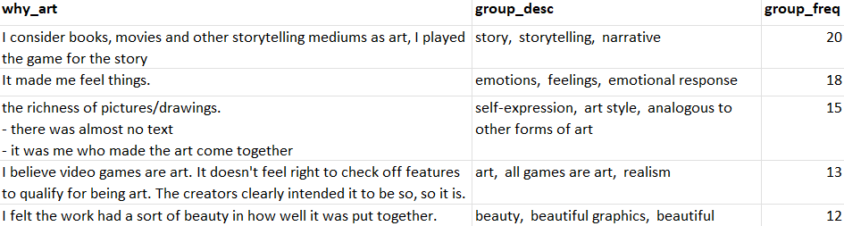
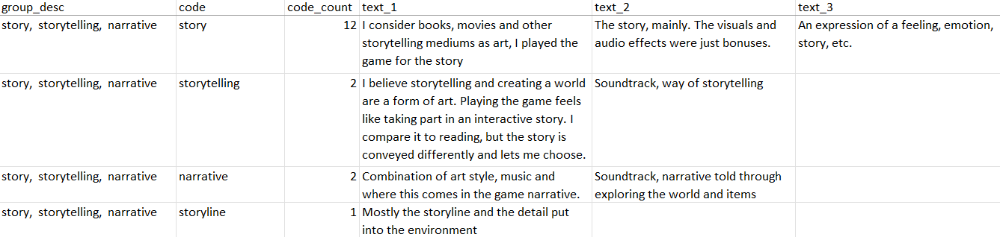
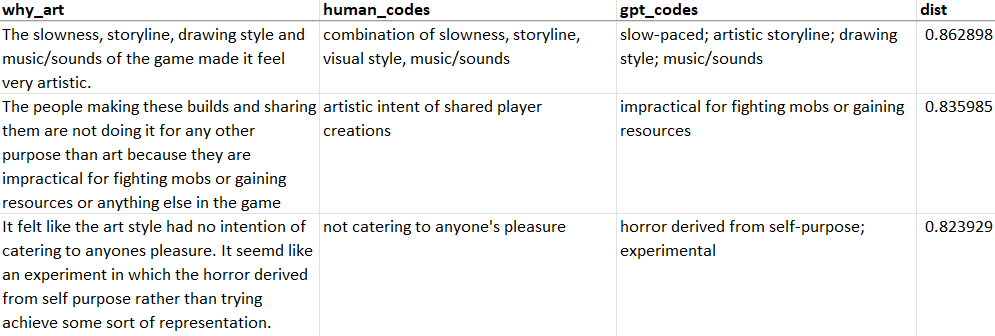

This repository contains the **llmcode** Python toolkit for **automatic qualitative data coding and analysis** using Large Language Models (LLMs). This is a further development of the initial version used for the CHI 2023 paper [Evaluating Large Language Models in Generating Synthetic HCI Research Data: a Case Study.](https://dl.acm.org/doi/abs/10.1145/3544548.3580688)

Currently, we only support OpenAI models via the OpenAI API, but support for open and locally run models such as StableLM is in the works.

*This initial release is still work-in-progress. Expect multiple updates during the next weeks.*

### Installing
Download the repository, navigate to its root folder in a command line window, and run:

    pip install -r requirements

You also need to have your OpenAI API key defined using the environment variable OPENAI_API_KEY

If you have Anaconda installed, you can run the following commands from a command line to install in a custom virtual environment.

    conda create --name llmcode python=3.8
    activate llmcode
    git clone https://github.com/PerttuHamalainen/LLMCode
    pip install -r requirements

### Data Preparation

To use llmcode, you should first format your data as a .csv that satisfies the following ([example data file](./test_data/bopp_test.csv)):

*	The texts to code (e.g., sentences or paragraphs) are in a single column, one text per row.
* A ”human_codes” column contains human-created example codes for at least some of the texts. These are used for specifying the coding style and also for analyzing code quality. If a text is assigned multiple codes, these should be separated by semicolons.
* A "use_as_example” column contains "1" for the human codes that specify the coding style, and is empty otherwise. We recommend using between 10 and 20 examples. More examples is better, but as these are added to a coding prompt for each coded text, the OpenAI API cost scales proportional to the number of examples. Too many examples may also make the prompt exceed the used LLM's context size limit.

Human codes that are not used as examples are used as validation data, for analyzing generated code quality.

### Coding the Data

Once you have the data formatted correctly, running the coding is easy from the command line, using the [analyze.py](analyze.py) helper. To test using the provided example data, run the following in the repository root folder:

    python analyze.py --input test_data/bopp_test.csv --output test_result --input_instr test_data/bopp_instruction.txt --column "why_art" --emb_context=", as a reason for experiencing games as art"

The arguments used above are:

<code>--input</code> The input .csv file

<code>--output</code> The output folder, where multiple result files will be created

<code>--input_instr</code> A text file that contains the coding instruction given to the LLM. In the example above, we use [these instructions](./test_data/bopp_instruction.txt).

<code>--column</code> The name of the .csv column containing the texts to code

<code>--emb_context</code> A context string that is appended to each generated code when generating code embeddings. This may help disambiguating codes that would be synonyms outside the specific context. In the example above, we use: ", as a reason for experiencing games as art"

Use <code>python analyze.py --help</code> for info about additional optional arguments.

### Generated Output
[analyze.py](analyze.py) produces a number of output .csv files, and also prints a summary to the command line window. The [test_results](test_results) folder of this repository provides example results using [Bopp et al.](https://osf.io/25ptc/) "Why was this game art?" question responses. Note that the human codes are by us, as Bopp et al. coded multiple questions and responses as a whole.

First, we provide a compact summary of code groups/themes, one group per row, and one example text:  

Second, we provide complete results in a .csv designed easy manual editing of the codes and groups/themes. There is one row per code, an extra column for higher-level code groups/themes, and one or multiple extra columns which contain the texts assigned with the code, one text per column:

The format should allow a human researcher to easily rename groups and move codes to different groups by copy-pasting the .csv lines.

### Evaluating Code Quality
For evaluating code quality using the validation codes, we also produce a .csv that shows the human and LLM codes side-by-side, sorted from most human-like to least human-like. Before carrying out further analyses on a particular dataset, **one should check the least human-like codes to see whether the LLM coding errors are acceptable.**

Here, human-likeness is calculated by treating the embedding vectors of the codes for a specific coded text as high-dimensional point clouds. The LLM and human point clouds are then compared using a Modified Hausdorff cosine distance metric. A distance of 0 means the codes are identical and both the LLM and human coder have assigned the same number of codes to the text.

Below, you can see the 3 least human-like codes assigned to the Bopp et al. responses using the <code>text-curie-001</code> model (our default):

Although the [full .csv](./test_results/bopp_test_human-gpt-comparison.csv) shows that the majority of codes are of high quality, the image above reveals that there are also errors such as the LLM missing the artistic intent that the human coder noticed.

On the other hand, the least human-like results can also reveal errors in the human coding. In the second example above, the human coder may have made a mistake in interpreting that the combination is the salient feature instead of the independent features, which the LLM has assigned separate codes.

### How the Coding Works

The coding and grouping is described in detail as part of Experiment 3 of the [CHI 2023 paper](https://dl.acm.org/doi/abs/10.1145/3544548.3580688). In brief, we first prompt a LLM with few-shot examples to perform the coding, compute LLM embedding vectors of the codes, reduce the dimensionality of the vectors using UMAP and then cluster the low-dimensional vectors using HDBSCAN.

Compared to the paper, this repository adds the code quality evaluation, allows defining the few-shot examples as part of the input .csv, and also randomly shuffles the few-shot examples for each coded text, to reduce the recency bias common in LLMs.

### Todo

* Colab notebook to allow usage without installing anything
* Interactive visualization and visual editing of the codes and groups
* Support for other language models such as StableLM — using a local model would mitigate the data protection issues one may have with OpenAI’s models.
* More thorough validation, once we have enough ground truth codes from multiple human coders
* Export to Atlas.ti and other qualitative analysis software, to allow more flexible manual refinement
* Automatic extraction of coded snippets from longer texts.

### Citation 

If you use this package for your research, please cite the paper:

    @inproceedings{10.1145/3544548.3580688,
    author = {H\"{a}m\"{a}l\"{a}inen, Perttu and Tavast, Mikke and Kunnari, Anton},
    title = {Evaluating Large Language Models in Generating Synthetic HCI Research Data: A Case Study},
    year = {2023},
    isbn = {9781450394215},
    publisher = {Association for Computing Machinery},
    address = {New York, NY, USA},
    url = {https://doi.org/10.1145/3544548.3580688},
    doi = {10.1145/3544548.3580688},
    abstract = {Collecting data is one of the bottlenecks of Human-Computer Interaction (HCI) research. Motivated by this, we explore the potential of large language models (LLMs) in generating synthetic user research data. We use OpenAI’s GPT-3 model to generate open-ended questionnaire responses about experiencing video games as art, a topic not tractable with traditional computational user models. We test whether synthetic responses can be distinguished from real responses, analyze errors of synthetic data, and investigate content similarities between synthetic and real data. We conclude that GPT-3 can, in this context, yield believable accounts of HCI experiences. Given the low cost and high speed of LLM data generation, synthetic data should be useful in ideating and piloting new experiments, although any findings must obviously always be validated with real data. The results also raise concerns: if employed by malicious users of crowdsourcing services, LLMs may make crowdsourcing of self-report data fundamentally unreliable.},
    booktitle = {Proceedings of the 2023 CHI Conference on Human Factors in Computing Systems},
    articleno = {433},
    numpages = {19},
    keywords = {User experience, Language models, User models, GPT-3},
    location = {Hamburg, Germany},
    series = {CHI '23}
    }
