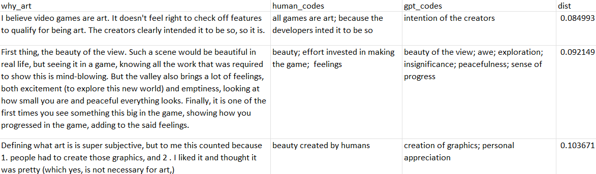

This repository contains the **LLMCode** Python toolkit for **AI-assisted qualitative data coding and analysis** using Large Language Models (LLMs). This is a further development of the initial version used for the CHI 2023 paper [Evaluating Large Language Models in Generating Synthetic HCI Research Data: a Case Study.](https://dl.acm.org/doi/abs/10.1145/3544548.3580688)

Here's an example of the codes and themes created by LLMCode for text data about experiencing video games as art:


Currently, we only support OpenAI models via the OpenAI API (not GDPR-compliant!), but support for open and locally run models such as Llama 2 is in the works.

### Executive Summary
**LLMCode codes and analyzes a dataset of texts based on human-created example codes and themes.** Traditional qualitative content analysis and thematic analysis can very labor-intensive, and our goal is to enable extending such analyses to **large-scale data** such as online discussions. At the same time, we prioritize maintaining **researcher agency and control**. LLMCode can also be considered to implement **topic modeling** but in a way that brings it closer to manual qualitative analysis.

For instance, in a study about why people experience games as art (the .gif above), the codes might be concise summaries of the reasons given in open-ended answers:

Answer: *A group of people took time and effort in making this area of the game, Kaer Morhen (and honestly most of the game too, the experience was simply more profound here), so beautiful. It was akin to looking at a photographer's work and wanting to physically visit where the picture was taken.*  

Codes: *effort invested in making the game; beauty*

After coding, the codes might then be grouped into broader categories or topics for further analysis and reporting.

In particular, LLMCode is designed to assist a researcher in the first 3 stages of the thematic analysis process of [Braun & Clarke](https://biotap.utk.edu/wp-content/uploads/2019/10/Using-thematic-analysis-in-psychology-1.pdf.pdf):

*1. Familiarizing yourself with the data:* Using LLMCode, you need to go through your data until you can come up with a coding scheme/style and some initial examples.  

*2. Generating initial codes:* You need to provide around 10 pairs of example texts and codes. LLMCode will extrapolate from these to code the rest. Optionally, you can code more data manually, which LLMCode will use to evaluate the AI coding quality.

*3. Searching for themes:* LLMCode can group codes into initial groups or themes. This can be done automatically or based on human-defined examples.

The results are saved in as a .csv that allows easy editing and refinement by a human researcher using spreadsheet tool such as Google Sheets (see below for details). A custom visual editing interface is also in the works.


### How to install and use
#### Step 1: Setup an OpenAI account
1. Create an OpenAI account at [https://platform.openai.com](https://platform.openai.com).
2. Go to the account management page
3. Choose "Billing" and buy a fixed amount of usage (at least 1€) or setup continuous billing with a monthly quota for safety reasons
4. Choose "API keys" and create an API key. The system gives you a private key that you should store in a safe place, e.g., a password manager. See Step 4 below for how to use the stored key.

*Important info regarding API costs:*
* LLMCode presently only supports OpenAI LLMs, which means that using it costs money. YOU USE LLMCODE AT YOUR OWN RISK.
* For instance, the analysis Step 4 below costs approximately 0.5€.
* To minimize costs, it's good to first test with smaller datasets of up to few hundred entries
* It is also recommended to use the OpenAI management interface to limit API spend, either by purchasing fixed amounts of credits or defining a monthly quota
* LLMCode minimizes the costs by caching the LLM API query results. This means that if you code the exact same data again with the same model, instructions, and examples, the results will be returned from the cache. If you need to delete the cache, e.g., to save disk space, you can navigate to where you installed the LLMCode (see below), navigate to the ```LLMCode/llmcode/cache``` folder, and delete the folders. There is one cache folder for each analyzed input data file


#### Step 2: Download and install LLMCode

*Option 1: Using Anaconda (recommended)*

Download and install [Anaconda](https://www.anaconda.com/) and [git](https://git-scm.com/download/win), if you don't already have them.

Open the Anaconda command prompt and run the following commands:

    conda create --name llmcode python=3.8
    activate llmcode
    git clone https://github.com/PerttuHamalainen/LLMCode
    cd LLMCode
    pip install -r requirements.txt


*Option 2: Install without Anaconda*

If you don't have Anaconda but have Python installed, download the repository, navigate to its root folder in a command line window, and run:

    pip install -r requirements


#### Step 3: Prepare your data

To use LLMCode, you should first format your data as a .csv or .xlsx like this [example file](./test_data/bopp_test.csv):

*	The texts to code (e.g., sentences or paragraphs) are in a single column, one text per row.
* The first cell of the "coding_instructions" column contains freeform coding instructions, typically explaining the context and goals of the analysis, and what the codes represent.
* The first cell of the "grouping_instructions" column contains freeform instructions for grouping the codes into themes.
* A ”human_codes” column contains human-created example codes for at least some of the texts. These are used for specifying the coding style and also for analyzing code quality. If a text is assigned multiple codes, these should be separated by semicolons.
* A "use_as_example” column contains "1" for the human codes that specify the coding style, and is empty otherwise. We recommend using between 10 and 20 examples. More examples is better, but as these are added to a coding prompt for each coded text, the OpenAI API cost scales proportional to the number of examples. Too many examples may also make the prompt exceed the used LLM's context size limit.
* A "human_themes" column contains themes for the coding examples. These are optional and do not have to be specified for each example.

Human codes that are not used as examples are used as validation data, for analyzing generated code quality and highlighting where and how the AI codes differ from the human codes.


#### Step 4: Run the analysis

Once you have the data formatted correctly, running the coding and grouping is easy from the Anaconda command prompt line, using the [analyze.py](analyze.py) helper.

First, LLMCode needs your OpenAI API key through the OPENAI_API_KEY environment variable. How to set environment variables varies for each operating system. On Windows, you can do this from the Anaconda command prompt as:

    set OPENAI_API_KEY=<your key here>

To test using the provided example data, run the following in the repository root folder, in the same command line window where you set the API key above:

    python analyze.py --input test_data/bopp_test.csv --output test_results --column "why_art" --emb_context ", in context of experiencing games as art"

The arguments used above are:

<code>--input</code> The input .csv or .xlsx file

<code>--output</code> The output folder, where multiple result files will be created

<code>--column</code> The name of the .csv column containing the texts to code

<code>--emb_context</code> A context string that is appended to each generated code when computing semantic embedding vectors of the codes. The embedding vectors are used for visualizing the codes and for comparing human and LLM-generated codes. Using the context string may help disambiguating codes that would be synonyms outside the specific context. In the example above, we use: ", in context of experiencing games as art". For example, without this context string, the embeddings for "immersion" and "swimming" are very close to each other, although the concepts have different meanings in this context.

Use <code>python analyze.py --help</code> for info about additional optional arguments.

#### Step 5: View the analysis results

[analyze.py](analyze.py) produces a number of output .csv files, prints a summary to the command line window, and also generates an output visualization like the one above. The [test_results](test_results) folder of this repository provides example results using [Bopp et al.](https://osf.io/25ptc/) "Why was this game art?" question responses. Note that the human codes are by us, as Bopp et al. coded multiple questions and responses as a whole.

The output are named by appending the input file name with different suffixes:

* **\<input_file_name\>_codes_grouped.csv**: This is the main output, with one theme and code per row, sorted by theme and code frequencies. The coded texts are provided in extra columns to allow easy mapping of codes to raw data and back, as shown in the screenshot below. The format should allow a human researcher to easily rename themes and move codes under different themes by copy-pasting the table lines.
* **\<input_file_name\>_codes_visualized.html**: An interactive Plotly visualization of the codes and themes, using the embedding vectors to place semantically similar codes close to each other. You can open this in a browser and use the mouse to browse the data.
* **\<input_file_name\>_coded.csv**: The input data appended with a new column with the codes
* **\<input_file_name\>_human-llm-comparison.csv**: Coding quality evaluation results (see the section "Evaluating Code Quality" below)
* **\<input_file_name\>_prompt.txt**: An example of the exact coding prompt sent to the LLM, including the few-shot examples. This is mainly provided for debug purposes. Note that for each coded text, the order of the examples is shuffled randomly to alleviate the recency bias of LLMs.  


### Evaluating Code Quality
For evaluating code quality using the validation codes, we also produce a .csv that shows the human and LLM codes side-by-side, sorted from most human-like to least human-like. Before carrying out further analyses on a particular dataset, **one should check the least human-like codes to see whether the LLM coding errors are acceptable.**

Here, human-likeness is calculated by treating the embedding vectors of the codes for a specific coded text as high-dimensional point clouds. The LLM and human point clouds are then compared using a Modified Hausdorff cosine distance metric. A distance of 0 means the codes are identical and both the LLM and human coder have assigned the same number of codes to the text.

Below, you can see the 3 Bopp et al. texts with the least human-like codes output by the <code>gpt-3.5-turbo</code> model:



Although the [full .csv](./test_results/bopp_test_human-llm-comparison.csv) shows that the majority of codes are of high quality, the image above reveals that there are also errors such as the LLM missing the categorical "games are art" statement. Then again, the middle response is more thoroughly coded by the LLM, whereas the human coder missed some points made in the long answer. The human coder might have been tired, whereas the LLM looks at each text with "fresh eyes".


### Improving Code Quality

If the coding errors are not acceptable for you, you can try the following:

* Refine your coding instructions and examples to be as specific, unambiguous, and representative as possible.  
* Select a better LLM using the <code>--coding_model</code> switch of analyze.py. Our default is <code>gpt-3.5-turbo</code>, but you might try the more powerful <code>gpt-4</code> model.
* Add more coding examples, up to a few dozen, if possible within the context size limit of the LLM.


### How the Coding and Grouping Works


An initial version of the coding and grouping is described as part of Experiment 3 of the [CHI 2023 paper](https://dl.acm.org/doi/abs/10.1145/3544548.3580688). In brief, we first prompted the LLM with few-shot examples to perform the coding, computed LLM embedding vectors of the codes, reduced the dimensionality of the vectors using UMAP and then clustered the low-dimensional vectors using HDBSCAN.

However, as the dimensionality reduction and clustering are sensitive to various hyperparameters and clustering may sometimes group together concepts that are quite distinct, we have now moved on to producing the themes through prompting, based on user-defined examples.

Compared to the paper, this repository also adds the code quality evaluation and randomly shuffles the few-shot examples for each coded text, to reduce the recency bias common in LLMs.


### Why not just use ChatGPT/GPT-4?
The most recent LLMs like ChatGPT can conduct a form of qualitative analysis out of the box: Just paste your data to the chat, and ask ChatGPT to identify themes. However, this has multiple problems:

* All data must fit the maximum context size.
* Evaluating the quality and correctness of the results is hard. Often, ChatGPT may simply neglect large parts of your data.
* Correcting errors is hard.

LLMCode only requires that a single coded text and the coding examples fit the context. As explained above, LLMCode also provides tools for comparing the results to human-defined validation codes, and outputs the results in a format that allows manual refinement.


### Todo

* Colab notebook to allow usage without installing anything
* Interactive visualization and visual editing of the examples, codes, and themes
* Support for other language models such as Llama 2 — using a local model would mitigate the data protection issues one may have with OpenAI’s models.
* More thorough validation, once we have enough ground truth codes from multiple human coders
* Export to Atlas.ti and other qualitative analysis software, to allow more flexible manual refinement
* Automatic extraction of coded snippets from longer texts.


### Citation 

If you use LLMCode for your research, please cite the paper:

    @inproceedings{10.1145/3544548.3580688,
    author = {H\"{a}m\"{a}l\"{a}inen, Perttu and Tavast, Mikke and Kunnari, Anton},
    title = {Evaluating Large Language Models in Generating Synthetic HCI Research Data: A Case Study},
    year = {2023},
    isbn = {9781450394215},
    publisher = {Association for Computing Machinery},
    address = {New York, NY, USA},
    url = {https://doi.org/10.1145/3544548.3580688},
    doi = {10.1145/3544548.3580688},
    abstract = {Collecting data is one of the bottlenecks of Human-Computer Interaction (HCI) research. Motivated by this, we explore the potential of large language models (LLMs) in generating synthetic user research data. We use OpenAI’s GPT-3 model to generate open-ended questionnaire responses about experiencing video games as art, a topic not tractable with traditional computational user models. We test whether synthetic responses can be distinguished from real responses, analyze errors of synthetic data, and investigate content similarities between synthetic and real data. We conclude that GPT-3 can, in this context, yield believable accounts of HCI experiences. Given the low cost and high speed of LLM data generation, synthetic data should be useful in ideating and piloting new experiments, although any findings must obviously always be validated with real data. The results also raise concerns: if employed by malicious users of crowdsourcing services, LLMs may make crowdsourcing of self-report data fundamentally unreliable.},
    booktitle = {Proceedings of the 2023 CHI Conference on Human Factors in Computing Systems},
    articleno = {433},
    numpages = {19},
    keywords = {User experience, Language models, User models, GPT-3},
    location = {Hamburg, Germany},
    series = {CHI '23}
    }
